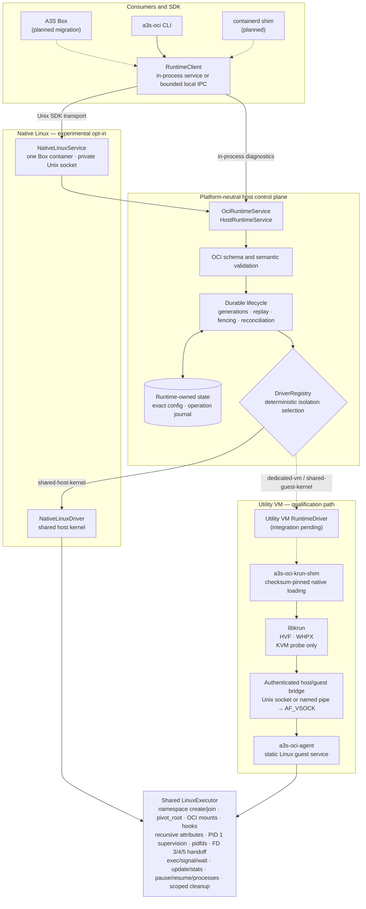

# A3S OCI Runtime

<p align="center">
  <strong>Cross-Platform OCI Runtime for A3S</strong>
</p>

<p align="center">
  <em>Run one reviewed Linux container executor natively on Linux or inside utility VMs on macOS and Windows</em>
</p>

<p align="center">
  <a href="#overview">Overview</a> •
  <a href="#features">Features</a> •
  <a href="#quick-start">Quick Start</a> •
  <a href="#runtime-model">Runtime Model</a> •
  <a href="#platform-status">Platform Status</a> •
  <a href="#architecture">Architecture</a> •
  <a href="#conformance-and-security">Conformance</a> •
  <a href="#development">Development</a>
</p>

---

## Overview

**A3S OCI Runtime** is the low-level execution boundary for Linux OCI
workloads across Linux, macOS, and Windows. It is designed to replace A3S
Box's direct dependency on an external OCI runtime binary while keeping image
management, builds, volumes, networks, and product policy in A3S Box.
The runtime never shells out to, discovers, or falls back to a second runtime.

The release target is complete
[OCI Runtime Specification 1.3.0](https://github.com/opencontainers/runtime-spec)
conformance for every Linux-container requirement and every advertised driver.
The public SDK carries the official OCI `Spec`, `Process`, `LinuxResources`,
`State`, and `Features` models without translating them into a reduced A3S
profile.

The runtime has two execution paths:

- **Native Linux** runs the reviewed namespace and mount profile with
  PID-reuse-safe init and exec process control without requiring KVM. The
  bootstrap slice now enforces its bounded cgroup v2, seccomp, capability, and
  device profile, including live CPU, memory, cpuset, and PID updates plus
  normalized resource statistics, piped stdin, and bounded captured
  stdout/stderr plus interactive PTYs, terminal resize, and all six OCI hook
  phases; broader OCI controls and hook recovery/security certification
  remain release gates.
- **Utility VM** hosts the same Linux executor behind an authenticated guest
  agent, using KVM on Linux, HVF on macOS, or WHPX on Windows.

The project is under active development. Host capability, driver maturity, and
effective isolation are reported separately so a working hypervisor probe can
never be mistaken for a production-ready workload driver.

### Basic usage

Feature discovery is available through the transport-independent Rust SDK:

```rust,no_run
use a3s_oci_runtime::HostRuntimeService;
use a3s_oci_sdk::RuntimeClient;

#[tokio::main(flavor = "current_thread")]
async fn main() -> a3s_oci_sdk::Result<()> {
    let client = RuntimeClient::new(HostRuntimeService::new());
    let features = client.features().await?;

    println!("{:?}", features.platform);
    for driver in features.drivers {
        println!(
            "{:?}: host={:?}, readiness={:?}",
            driver.driver, driver.status, driver.readiness
        );
    }
    Ok(())
}
```

Normal discovery exposes only operations backed by the selected implementation.
Workload calls require an explicitly supplied launch-ready `RuntimeDriver`.

## Features

- **Complete OCI Types**: Preserve official OCI runtime models and exact
  accepted `config.json` text across SDK and wire boundaries
- **Strict Validation**: Validate OCI 1.0.0 through 1.3.0 schemas, semantic
  relationships, paths, payload bounds, and immutable SHA-256 digests before
  state mutation
- **Durable Lifecycle**: Persist create, start, kill, pause, resume, delete,
  exec, and per-process signal with monotonic generations, operation IDs,
  replay, fencing, reconciliation, and quarantine; cache stable init and
  exec-process exit status across host-service reopen, and enumerate a
  deterministic isolation-filtered snapshot without driver dispatch
- **Ordered Runtime Events**: Persist exact-generation lifecycle and process
  events behind a global nonzero sequence, with replay-safe identities,
  bounded pagination, filtering, long polling, and crash repair
- **Shared Linux Executor**: Reuse one fail-closed namespace, mount, pidfd
  init/exec process-control, cgroup-v2 pause/resume, live process inventory,
  stable per-process exit-status, and cleanup implementation directly on
  Linux and through the guest agent, with independently fenced per-container
  generations; an opt-in control/workload layout keeps `linux.resources` as
  the exact workload limit while the runtime derives one bounded management
  envelope for a trusted in-container control plane
- **Ordered OCI Hooks**: Execute `prestart`, `createRuntime`,
  `createContainer`, `startContainer`, `poststart`, and `poststop` in their
  required namespaces and order, pass bounded OCI state JSON on stdin, apply
  timeout and process-group cleanup, and keep poststop failures warning-only
- **Bounded Process I/O**: Stream piped stdin with backpressure and poll
  globally ordered captured stdout/stderr through byte-accurate cursors, EOF
  frames, long polling, and an 8 MiB retained-output ceiling
- **Interactive Terminals**: Allocate controlling PTYs with explicit initial
  dimensions, merged ordered output, interactive input, terminal resize, and
  VEOF-based input close
- **Cross-Platform Drivers**: Inspect native Linux, KVM, HVF, and WHPX
  prerequisites without silently weakening requested isolation
- **Typed SDK and IPC**: Expose an async `Send + Sync` Rust contract with
  bounded local IPC over Unix sockets or Windows named pipes; foreground
  `run` composes the durable create/start/wait/delete calls in the client
  without adding a second lifecycle operation
- **Authenticated Guest Protocol**: Bind exact bundles and generations to a
  version-negotiated host/guest session with one-time token authentication
- **Retained Conformance Evidence**: Lock the OCI schemas and normative
  requirement inventory in CI so unreviewed coverage changes fail closed
- **Cross-Platform Soak Evidence**: Repeatedly keep independent native Linux
  containers live together, or start a fresh macOS HVF utility VM for every
  complete two-container matrix, while retaining lifecycle, generation,
  namespace, mount, PID-supervision, process, descriptor, and runtime cleanup
  evidence in versioned reports
- **Native Configuration Matrix**: Qualify private, host-inherited, and
  donor-shared network namespaces; shared read-write and read-only binds;
  isolated tmpfs mounts; inline, executable-file, and direct-argv init; exact
  nonzero exits; and create/start/timeout/poststop Hook behavior on real
  x86_64 and aarch64 containers

### Driver readiness

Host availability and implementation readiness are independent:

| Readiness | Workload launch | Meaning |
| --- | --- | --- |
| `probe-only` | Forbidden | Platform discovery or diagnostic smoke only |
| `experimental` | Explicit opt-in | Reviewed development profile with incomplete certification |
| `supported` | Allowed | Certified runtime profile |

`DriverCapability::can_launch()` requires both an available host capability and
`experimental` or `supported` readiness.

### Isolation classes

| Isolation | Boundary | Kernel sharing |
| --- | --- | --- |
| `dedicated-vm` | Hardware VM | One workload or pod owns the guest kernel |
| `shared-guest-kernel` | Hardware VM | One trust domain shares a guest Linux kernel |
| `shared-host-kernel` | No VM boundary | Containers share the Linux host kernel |

Windows and macOS cannot provide `shared-host-kernel` for Linux workloads.
Native Linux does not require KVM. An unavailable `dedicated-vm` request fails
before runtime state, image, or driver mutation.

## Quick Start

### Build and inspect

```sh
git clone git@github.com:A3S-Lab/OCI-Runtime.git
cd OCI-Runtime

cargo run -p a3s-oci-cli -- features
```

The command emits versioned JSON. A driver can report an available host
prerequisite while remaining `probe-only`.

Tagged releases publish SHA-256-verified GitHub archives for Linux x86_64,
Linux aarch64, macOS aarch64, and Windows x86_64. Download the archive matching
the host from the repository's Releases page, verify it against
`SHA256SUMS`, and place `a3s-oci` on `PATH`. Linux archives also contain the
matching native `a3s-oci-agent`; macOS archives contain the isolated libkrun
shim and checksum-pinned runtime bundle. Release packaging does not change the
readiness advertised by `a3s-oci features`.

### Native Linux lifecycle

The explicit rootful development gate proves the current OCI
create/start/update/stats/pause/resume/processes/kill/wait/delete,
exec/signal/wait-process, and read-output/write-stdin/close-stdin/resize vertical
slice without opening `/dev/kvm` or initializing libkrun:

```sh
sudo apt-get install busybox-static
cargo build -p a3s-oci-agent -p a3s-oci-cli

demo_root="$(mktemp -d)"
bundle="$demo_root/bundle"
work_parent="$demo_root/work"
mkdir -p "$bundle/rootfs/bin" "$bundle/rootfs/proc" "$work_parent"
cp fixtures/native-linux/config.json "$bundle/config.json"
cp "$(command -v busybox)" "$bundle/rootfs/bin/busybox"
ln -s busybox "$bundle/rootfs/bin/sh"
sudo chown -R 100000:200000 "$bundle/rootfs"
chmod 0755 "$demo_root"

sudo target/debug/a3s-oci native-linux-smoke \
  --agent "$PWD/target/debug/a3s-oci-agent" \
  --bundle "$bundle" \
  --work-parent "$work_parent"
```

Success requires the exact create/start barrier, exact-target exec and
duplicate process-ID rejection, replayed per-process signal, bounded and
stable init and exec waits, an exact live init/exec process inventory, a real
progress-producing workload that stops under cgroup-v2 pause and advances
again after resume, an idempotent live resource update with exact cgroup
read-back, normalized generation-fenced CPU, memory, PID, and event counters,
byte-accurate captured stdout/stderr pagination, EOF, piped stdin,
idempotent stdin close, and rejected writes after close or process exit,
controlling-terminal allocation, initial and resized dimensions, interactive
input, merged terminal output, and terminal VEOF close,
the Box production mapping of container root to host UID 100000 and GID
200000, A3S Box exec/PTY listeners inherited on FD 3/4 and an exact init-log
write on FD 5, the exact SIGKILL terminal results, running and stopped
observation, idempotent mutation replay, marker verification, post-delete
`NotFound`, and scoped cleanup. See
[Native Linux Development](docs/linux-native.md) for the accepted profile and
remaining production gates.

For the Box integration, one long-lived runtime owner is started for each
Sandbox. The launcher inherits the already-bound Box exec listener on FD 3,
PTY listener on FD 4, and writable init log on FD 5, then starts:

```text
a3s-oci native-linux-service \
  --root /absolute/private/sandbox/runtime \
  --agent /absolute/path/to/a3s-oci-agent \
  --container-id box-sandbox-42 \
  --a3s-box-control-fds
```

The parent of `--root` must already exist. The service creates or verifies the
root, `state`, and `executor` directories as owner-only `0700`, binds
`runtime.sock` as `0600`, accepts only same-UID peers, and allows the inherited
handles to be used by exactly the configured container ID. Box performs every
lifecycle call through `a3s-oci-sdk`:

```rust,no_run
use a3s_oci_sdk::{LocalIpcEndpoint, RuntimeClient};

# async fn connect() -> a3s_oci_sdk::Result<()> {
let endpoint = LocalIpcEndpoint::unix_socket(
    "/absolute/private/sandbox/runtime/runtime.sock",
)?;
let client = RuntimeClient::connect(&endpoint).await?;
let info = client.features().await?;
# let _ = info;
# Ok(())
# }
```

Normal SDK `create` automatically receives the bound Box handles; a create for
another container ID fails before driver dispatch. `SIGINT` or `SIGTERM` stops
all driver-owned processes, removes the transient executor root, and removes
only the exact socket inode created by that service. The complete transported
lifecycle can be exercised with:

```sh
sudo target/debug/a3s-oci native-linux-service-smoke \
  --agent "$PWD/target/debug/a3s-oci-agent" \
  --bundle "$bundle" \
  --work-parent "$work_parent"
```

The process-local adapter remains available for focused runtime tests:

```rust
use std::fs::OpenOptions;
use std::os::unix::net::UnixListener;
use a3s_oci_runtime::NativeControlDescriptors;

let controls = NativeControlDescriptors::new(
    UnixListener::bind(exec_socket_path)?,
    UnixListener::bind(pty_socket_path)?,
    OpenOptions::new()
        .read(true)
        .write(true)
        .create_new(true)
        .open(init_log_path)?,
)?;
let created = service
    .create_with_native_control_descriptors(create_request, controls)
    .await?;
```

Both forms consume typed handles, fingerprint only their stable logical
schema, and reject them unless the configured driver reports `native-linux`.

Create a second distinct bundle to run the multi-container gate:

```sh
bundle_b="$demo_root/bundle-b"
mkdir -p "$bundle_b/rootfs/bin" "$bundle_b/rootfs/proc"
cp fixtures/native-linux/config.json "$bundle_b/config.json"
jq '.linux.cgroupsPath = "a3s-oci-smoke-b"' \
  "$bundle_b/config.json" >"$bundle_b/config.json.tmp"
mv "$bundle_b/config.json.tmp" "$bundle_b/config.json"
cp "$(command -v busybox)" "$bundle_b/rootfs/bin/busybox"
ln -s busybox "$bundle_b/rootfs/bin/sh"
sudo chown -R 100000:200000 "$bundle_b/rootfs"

sudo target/debug/a3s-oci native-linux-multi-container-smoke \
  --agent "$PWD/target/debug/a3s-oci-agent" \
  --bundle-a "$bundle" \
  --bundle-b "$bundle_b" \
  --work-parent "$work_parent"
```

The versioned report retains two simultaneous create barriers, distinct
positive PIDs, operation replay isolation, A/B lifecycle independence,
nonblocking observation of B while A is being waited on, exact repeated exit
status for both containers, generation-1 rejection after A is recreated as
generation 2, dedicated namespace PID 1 supervision, adopted-orphan reaping,
and complete process, marker, executor-root, and durable-session cleanup. Its
native-only profile matrix additionally proves that a private network
namespace differs from the host, a host-network profile inherits the exact
host namespace, and a shared-network profile joins the exact donor identity.
Two simultaneously live containers exchange exact data through a shared bind,
enforce a read-only reader, receive isolated tmpfs instances, and retain the
bind data for a fresh reader after writer deletion. Sequential init profiles
cover inline shell, an executable script with environment, direct argv, and an
exact exit code 42; negative Hook profiles prove create rollback, start
failure cleanup, timeout process-group cleanup, and warning-only poststop.

### Native Linux complex-container soak

`native-linux-soak` extends the fixed two-container gate into configurable
churn. Every concurrent slot must have a distinct writable bundle, rootfs,
and cgroup path. The following prepares four slots and completes 100 waves,
for 400 independently generation-fenced container lifecycles:

```sh
soak_args=()
for slot in 0 1 2 3; do
  soak_bundle="$demo_root/soak-bundle-$slot"
  mkdir -p "$soak_bundle/rootfs/bin" "$soak_bundle/rootfs/proc"
  cp fixtures/native-linux/config.json "$soak_bundle/config.json"
  jq --arg cgroup "a3s-oci-soak-$slot" \
    '.linux.cgroupsPath = $cgroup' \
    "$soak_bundle/config.json" >"$soak_bundle/config.json.tmp"
  mv "$soak_bundle/config.json.tmp" "$soak_bundle/config.json"
  cp "$(command -v busybox)" "$soak_bundle/rootfs/bin/busybox"
  ln -s busybox "$soak_bundle/rootfs/bin/sh"
  sudo chown -R 100000:200000 "$soak_bundle/rootfs"
  soak_args+=(--bundle "$soak_bundle")
done

sudo target/debug/a3s-oci native-linux-soak \
  --agent "$PWD/target/debug/a3s-oci-agent" \
  --work-parent "$work_parent" \
  --iterations 100 \
  --concurrent-containers 4 \
  --operation-timeout-ms 30000 \
  "${soak_args[@]}"
```

The `a3s.oci.native-linux-soak.v1` report counts every successful SDK call.
Each wave concurrently creates and starts all slots, verifies the exact live
set, positive unique PIDs, state, process inventory, resource statistics, and
captured exec output, pauses every container, drops and reopens the durable
host service, verifies the paused set, then resumes, kills, waits, and deletes
all slots. Reused IDs must advance by exactly one generation and reject every
prior exact target. A successful report additionally requires an empty list,
empty transient executor root, removed markers, restored direct-child count,
and a stable open-descriptor count after every clean wave, followed by full
executor and session removal.

Configuration is bounded to 1–10,000 iterations, 2–32 concurrent containers,
and 100–300,000 ms per operation. Repository CI defaults to 25 waves with four
simultaneous containers, or 100 complete lifecycles, on both x86_64 and
aarch64. `A3S_OCI_NATIVE_SOAK_ITERATIONS` can reduce or extend that gate while
preserving dynamically calculated report assertions. Both jobs upload the
JSON report as retained CI evidence.

The separate fault-cleanup diagnostic deliberately stops before OCI delete and
requires executor shutdown to reclaim the live process and all scoped state:

```sh
for fault in after-create after-start after-kill; do
  sudo target/debug/a3s-oci native-linux-fault-cleanup \
    --agent "$PWD/target/debug/a3s-oci-agent" \
    --bundle "$bundle" \
    --work-parent "$work_parent" \
    --fault-after "$fault"
done
```

Each `a3s.oci.native-linux-fault-cleanup.v6` success identifies the exact
injected boundary, records that normal delete was not attempted, and proves
that the configured-process PID, executor root, marker, and complete
diagnostic session were removed.

### Rootless native Linux lifecycle

The same native driver can run its core lifecycle as a non-root host user.
Rootless execution requires the distribution's setuid-root `newuidmap` and
`newgidmap` helpers, an enabled unprivileged-user-namespace policy, empty host
supplementary groups, and subordinate ranges assigned in `/etc/subuid` and
`/etc/subgid`. Container ID 0 must map exactly to the executor's effective
host UID/GID with size 1; later container IDs use the subordinate ranges.
Rootless bundles cannot request `process.user.additionalGids`, and the current
qualified profile deliberately omits `linux.cgroupsPath` until cgroup-v2
delegation is implemented.

The repository gate creates a dedicated UID/GID 20000 user, delegates UID
300000 and GID 400000 ranges, and runs the CLI with all supplementary groups
cleared:

```sh
bash .github/scripts/native-linux-smoke.sh
```

Its `a3s.oci.native-linux-rootless-smoke.v1` report proves exact helper-backed
UID/GID map read-back, `setgroups=deny`, container ownership translation for
ID 1, create/start/exec/signal/wait/kill/delete replay, ordered durable events,
post-delete state removal, and complete process and runtime-root cleanup on
x86_64 and aarch64. This is a core rootless lifecycle gate, not a claim of
rootless cgroup, device, LSM, or full OCI conformance.

### macOS host gates

On Apple Silicon, sign a disposable CLI copy with the checked-in Hypervisor
entitlement and exercise the real HVF VM-object lifecycle:

```sh
cargo build -p a3s-oci-cli

smoke_dir="$(mktemp -d)"
cp target/debug/a3s-oci "$smoke_dir/a3s-oci"
codesign --force --sign - \
  --entitlements packaging/macos/a3s-oci-hvf.entitlements \
  "$smoke_dir/a3s-oci"
"$smoke_dir/a3s-oci" hvf-smoke
```

The `a3s.oci.hvf-smoke.v1` report succeeds only when
`hv_vm_create` and `hv_vm_destroy` both complete. An executable without the
entitlement fails closed with `HV_DENIED`.

The isolated shim has a separate libkrun context gate:

```sh
cargo build -p a3s-oci-krun

smoke_dir="$(mktemp -d)"
cp target/debug/a3s-oci-krun-shim "$smoke_dir/"
cp -R target/debug/a3s-oci-krun-runtime "$smoke_dir/"
codesign --force --sign - \
  --entitlements packaging/macos/a3s-oci-hvf.entitlements \
  "$smoke_dir/a3s-oci-krun-shim"
"$smoke_dir/a3s-oci-krun-shim" context-smoke
```

This verifies the checksum-pinned runtime bundle, required libkrun symbols,
context allocation, VM resource configuration, plain-vsock guest port mapping,
and context release.

The VM-entry gate then boots the bundled arm64 kernel with a pinned Alpine
userspace and accepts success only after the guest writes an exact marker into
the shared rootfs:

```sh
rootfs_dir="$(mktemp -d)"
rootfs_archive="$rootfs_dir/alpine-minirootfs-3.22.5-aarch64.tar.gz"
curl --fail --location --output "$rootfs_archive" \
  https://dl-cdn.alpinelinux.org/alpine/v3.22/releases/aarch64/alpine-minirootfs-3.22.5-aarch64.tar.gz
printf '%s  %s\n' \
  '3fbc6285032ed46821b511292633d7b2a6306a2e254f590e92bdafff56cf2f70' \
  "$rootfs_archive" | shasum -a 256 --check
mkdir "$rootfs_dir/rootfs"
tar -xzf "$rootfs_archive" -C "$rootfs_dir/rootfs"

"$smoke_dir/a3s-oci-krun-shim" vm-smoke \
  --rootfs "$rootfs_dir/rootfs" \
  --console "$rootfs_dir/console.log"
```

Because `krun_start_enter` takes over its process, the command configures and
enters the VM in a private worker, enforces a 30-second bound, reaps the worker,
checks its exit status, verifies and removes the guest marker, and fails closed
when HVF is unavailable. See
[macOS HVF Development](docs/macos-hvf.md) for the exact boundary and retained
evidence.

The authenticated bridge gate installs the static arm64 Linux agent into that
rootfs and exercises the complete host-to-guest negotiation:

```sh
rustup target add aarch64-unknown-linux-musl
host_triple="$(rustc -vV | sed -n 's/^host: //p')"
rust_lld="$(
  rustc --print sysroot
)/lib/rustlib/$host_triple/bin/rust-lld"
CARGO_TARGET_AARCH64_UNKNOWN_LINUX_MUSL_LINKER="$rust_lld" \
  cargo build -p a3s-oci-agent --release \
    --target aarch64-unknown-linux-musl
cargo build -p a3s-oci-cli

install -d "$rootfs_dir/rootfs/usr/bin"
install -m 0755 \
  target/aarch64-unknown-linux-musl/release/a3s-oci-agent \
  "$rootfs_dir/rootfs/usr/bin/a3s-oci-agent"

target/debug/a3s-oci agent-vm-smoke \
  --shim "$smoke_dir/a3s-oci-krun-shim" \
  --rootfs "$rootfs_dir/rootfs" \
  --console "$rootfs_dir/agent-console.log"
```

An `a3s.oci.agent-vm-smoke.v8` success proves a private host socket, the
expected shim and direct worker PID relationship, one-time token
authentication, protocol version 8, the arm64 guest identity, and the exact
eighteen guest operations (`create`, `state`, `start`, `kill`, `delete`,
`wait`, `exec`, `signal-process`, `wait-process`, `pause`, `resume`,
`processes`, `update`, `stats`, `read-output`, `write-stdin`, and
`close-stdin`, plus `resize`). It also requires the exact runtime-owned
endpoint to be removed, the current process's complete descriptor inventory to
return to its pre-session baseline, and both observed host process IDs to
disappear.

The fixed lifecycle gate then runs the same reviewed OCI bundle through HVF
that the Windows qualification runs through WHPX:

```sh
bundle="$rootfs_dir/rootfs/var/lib/a3s-oci-smoke/bundle"
mkdir -p "$bundle/rootfs"
cp fixtures/utility-vm/config.json "$bundle/config.json"
tar -xzf "$rootfs_archive" -C "$bundle/rootfs"
sudo chown -R 0:0 "$bundle/rootfs"

target/debug/a3s-oci oci-vm-smoke \
  --shim "$smoke_dir/a3s-oci-krun-shim" \
  --vm-rootfs "$rootfs_dir/rootfs" \
  --bundle "$bundle" \
  --console "$rootfs_dir/oci-console.log"
```

An `a3s.oci.oci-vm-smoke.v8` success proves distinct create and start, exact
create/kill/delete replay, a
bounded wait while running, exact and replayed normal exit status after the
SIGTERM trap, running and stopped observation, marker verification,
post-delete `NotFound`, exact-target exec replay, duplicate process-ID
rejection, bounded and stable per-process wait, replayed pidfd signal delivery,
an exact init/exec process inventory, idempotent live CPU, memory, cpuset, and
PID updates, normalized cgroup-v2 statistics, pause/resume replay, a real
workload that stops advancing while frozen and continues after resume,
byte-accurate captured stdout/stderr polling with EOF, exactly replayed piped
stdin writes and idempotent close, rejected late writes, controlling PTY allocation, interactive
terminal input, exact initial and resized dimensions, merged output, terminal
VEOF, init-exit cleanup of a live exec process, and nominal endpoint, process,
marker, and guest-runtime cleanup. This remains a fixed development profile
rather than an arbitrary-workload driver.

The multi-container gate places two distinct bundles in the same guest and
keeps both configured processes behind the create barrier:

```sh
bundle_b="$rootfs_dir/rootfs/var/lib/a3s-oci-smoke/bundle-b"
mkdir -p "$bundle_b/rootfs"
cp fixtures/utility-vm/config.json "$bundle_b/config.json"
jq '.linux.cgroupsPath = "a3s-oci-smoke-b"' \
  "$bundle_b/config.json" >"$bundle_b/config.json.tmp"
mv "$bundle_b/config.json.tmp" "$bundle_b/config.json"
tar -xzf "$rootfs_archive" -C "$bundle_b/rootfs"
sudo chown -R 0:0 "$bundle_b/rootfs"

target/debug/a3s-oci oci-vm-multi-container-smoke \
  --shim "$smoke_dir/a3s-oci-krun-shim" \
  --vm-rootfs "$rootfs_dir/rootfs" \
  --bundle-a "$bundle" \
  --bundle-b "$bundle_b" \
  --console "$rootfs_dir/oci-multi-container.log"
```

`a3s.oci.oci-vm-multi-container-smoke.v9` requires that starting, killing,
waiting for, and deleting A never changes or blocks B; both waits return and
replay the exact normal exit status; recreating A advances generation 1 to 2;
stale and cross-container replay requests fail; B then completes
independently; existing namespace descriptors are type-checked and joined
across the shared executor; a third workload proves missing mount-target
creation, shared rootfs propagation, a read-only path, an empty masked file,
recursive read-only/noexec/nosymfollow attributes across a nested submount, and
explicit `idmap` and `ridmap` ownership on detached filesystem mounts, a
read-only rootfs, a PID 2+ configured process beneath a dedicated namespace
PID 1, and adopted-orphan reaping before exact cleanup; and VM shutdown
restores guest-runtime, endpoint, descriptor, shim, and worker inventories.

The macOS soak gate repeats that complete matrix in a fresh authenticated HVF
utility VM for every wave:

```sh
console_dir="$rootfs_dir/macos-hvf-soak-consoles"
mkdir "$console_dir"

target/debug/a3s-oci macos-hvf-soak \
  --shim "$smoke_dir/a3s-oci-krun-shim" \
  --vm-rootfs "$rootfs_dir/rootfs" \
  --bundle-a "$bundle" \
  --bundle-b "$bundle_b" \
  --console-dir "$console_dir" \
  --iterations 25
```

`a3s.oci.macos-hvf-soak.v1` accepts 1–10,000 serial waves and fixes each wave
at two primary concurrent containers. Success requires all configured VM
lifecycles and three primary generations per wave, complete lifecycle,
namespace-join, rootfs/mount, and PID-supervision evidence, distinct protected
endpoint names, exact marker and guest-runtime cleanup, shim and VM-worker
reaping, and identical descriptor counts before and after every wave. Console
paths are iteration-scoped and existing files are never overwritten. macOS CI
requires 25 successful waves when HVF is available and uploads the JSON report
and all per-wave consoles; an unavailable host must instead retain a
first-wave fail-closed report.

Fault cleanup reuses the same signed shim and bundle but stops after each
successful lifecycle boundary:

```sh
fault_dir="$(mktemp -d)"
for fault in after-create after-start after-kill; do
  target/debug/a3s-oci oci-vm-fault-cleanup \
    --shim "$smoke_dir/a3s-oci-krun-shim" \
    --vm-rootfs "$rootfs_dir/rootfs" \
    --bundle "$bundle" \
    --console "$fault_dir/$fault.log" \
    --fault-after "$fault"
done
```

An `a3s.oci.oci-vm-fault-cleanup.v4` success requires no normal delete call,
guest executor shutdown, marker and runtime-root removal, exact endpoint
removal, shim and VM-worker reap, and restoration of the complete host
descriptor inventory.

### Windows utility VM diagnostics

On a WHPX-capable Windows host:

```powershell
cargo run -p a3s-oci-cli -- whpx-smoke
cargo run -p a3s-oci-krun --bin a3s-oci-krun-shim -- context-smoke
```

The repository also provides a hardware soak that builds the static Linux
agent and Windows host binaries, then exercises the authenticated WHPX path:

```powershell
powershell.exe -NoProfile -ExecutionPolicy Bypass `
  -File .\scripts\windows-whpx-soak.ps1 `
  -RootfsArchive C:\path\to\alpine-minirootfs.tar
```

The default gate runs 25 serial lifecycles, three two-VM parallel waves,
three two-container lifecycles inside one VM, cleanup faults after create,
start, and kill, private and inherited network profiles, read-write and
read-only bind volumes, successful and failing init scripts, ten typed
negative cases, and four owner-termination timing points. It fails on count
drift, leaked host or guest runtime state, missing resource samples, excessive
host working set or log growth, or a shim that survives its owner for 20
seconds. `summary.json`, `verify.out`, inventories, capability results,
operation rows, resource samples, and per-case JSON/logs form the retained
evidence contract.

The packaged Windows runtime uses `A3S-Lab/libkrun@9480ee3`, whose 3 KiB
host-to-guest read segmentation prevents a request larger than one guest
receive descriptor from stalling. A focused August 1, 2026 transport
qualification completed one serial lifecycle, two parallel lifecycles, five
workload cases, nine fail-closed negatives, and four owner-termination cases
in 63.970 seconds. Its storage request was larger than 4 KiB, every case left
zero A3S host processes and guest runtime directories, and it pinned
`krun.dll` SHA-256
`ab8ceb013795fa8b43a3793f9579179c0afb9608430af1c21f6e9145cf27d7d9`.
The current default gate above remains the broader release profile.

The Windows fixture intentionally omits user and time namespaces and the swap
controller, which the current WHPX utility kernel has not qualified. Those
omissions are not reported as passing coverage. See
[Windows WHPX Development](docs/windows-whpx.md) for the required runtime
assets and commands.

## Runtime Model

### OCI lifecycle

The create/start barrier is explicit:

```text
creating ── create completed ──▶ created
created  ── start completed  ──▶ running
running  ── process exited   ──▶ stopped
```

`create` prepares isolation and the configured-process wrapper without
executing the configured program. Only `start` releases that process. Invalid
transitions fail without weakening the barrier.

The shared Linux executor preserves the OCI hook boundaries explicitly:

```text
create:  prestart → createRuntime → createContainer → created
start:   startContainer → execve → poststart → running
delete:  destroy container resources → poststop
```

Runtime-namespace hooks execute in the agent, while `createContainer` and
`startContainer` execute inside the container namespaces. Every hook receives
the exact bounded OCI `State` document on stdin. A configured timeout covers
state delivery and the complete hook process group. Failed create/start hooks
return typed errors; poststop logs warnings, continues the remaining hooks,
and never reverses cleanup.

The host lifecycle stores:

- the exact validated OCI configuration and digest;
- a monotonically increasing container generation;
- global idempotency records keyed by `OperationId`;
- active operation intent and terminal replay results;
- reconciliation and quarantine state for interrupted operations.

Matching retries reproduce the original result. Stale generations, reused
operation IDs with different payloads, invalid isolation, and unsupported
configuration fail before driver mutation.

`RuntimeClient::run` is a foreground convenience composition, not a service
or transport method. Its `RunRequest` carries distinct operation contexts for
create, start, and delete. Once create succeeds, the client always submits the
same force-delete request before returning, including after a start or wait
error, so partial lifecycle ownership remains explicit and cleanup retries use
one stable request identity.

The shared Linux executor independently indexes every live `(container ID,
generation)` pair, retains a highest-generation fence after delete, and gives
each container a private runtime slot. The native Linux and macOS utility-VM
multi-container gates keep two slots live concurrently and verify that every
state transition and replay remains container-scoped.

### Linux executor boundary

The current executor implements a reviewed bootstrap vertical slice:

- new UTS, mount, IPC, network, cgroup, PID, user, and time namespaces;
- parent-authenticated UID/GID mappings plus read-back verification: direct
  rootful maps include the A3S Box production mapping of container root to
  host UID 100000 and GID 200000, while rootless maps use verified
  setuid-root `newuidmap`/`newgidmap` helpers, exact effective-ID root entries,
  subordinate ranges, and `setgroups=deny`; normalized monotonic and boottime
  offsets are applied before the first time-namespace child;
- type-checked joins for existing UTS, mount, IPC, network, cgroup, PID, user,
  and time namespaces, including retained rootfs access after a mount join;
- hostname and domain name configuration;
- isolated mount propagation and `pivot_root`, including all four OCI
  `rootfsPropagation` modes;
- ordered OCI mounts with missing directory/file target creation, bind/rbind,
  common VFS options, recursive `mount_setattr` attributes, detached
  ID-mapped filesystem and bind mounts, and symlink-escape rejection;
- OCI masked paths, read-only paths, and a read-only rootfs;
- a bounded cgroup v2 profile covering memory limit/reservation/swap, CPU
  quota/period/shares/cpuset, and PID limits, with controller availability and
  setting read-back checks, live partial updates with rollback, normalized
  CPU/memory/PID/event statistics, plus `cgroup.freeze` transitions verified
  through `cgroup.events`; the executor owns a private controller-enabled
  cgroup root so a container can receive limits after an initially unlimited
  create; the versioned `control-workload-v1` annotation layout additionally
  creates fixed `a3s-control` and `a3s-workload` children, passes their
  pre-opened `cgroup.procs` descriptors only to the trusted init, keeps
  `linux.resources` exact on the workload child, derives outer CPU, memory,
  and PID headroom, and applies update/freeze/stats plus OOM accounting to the
  workload child;
- exact process bounding/effective/permitted/inheritable/ambient capability
  sets, including an init capability ceiling for later exec processes;
- all 16 OCI `process.rlimits` types, with bounded unique planning,
  soft/hard validation, architecture-correct libc resources, and identical
  pre-credential enforcement for init and exec;
- bounded OCI device profiles with default-deny policy-shape validation,
  exact device-node creation and read-back, rootfs scans, `nodev` bind
  enforcement, and CAP_MKNOD exclusion;
- architecture-bound seccomp BPF for x86_64 and AArch64, including OCI
  argument comparisons, distinct errno actions, and the same retained policy
  on init and exec;
- PID- and namespace-authenticated create barrier with a distinct
  pre-pivot hook release, plus close-on-exec confirmation at the start
  barrier;
- ordered `prestart`, `createRuntime`, `createContainer`, `startContainer`,
  `poststart`, and `poststop` hooks with exact OCI state on stdin, bounded
  plans, optional environments, timeout enforcement, process-group cleanup,
  typed failure propagation, and warning-only poststop continuation;
- credentials, umask, `no_new_privileges`, `execve`, PID-reuse-safe pidfd
  signaling, dedicated configured/exec workload process groups, replay-safe
  container-wide signal fan-out, a cross-process signal/reap lease that closes
  numeric PGID reuse races, exact normal-or-signal exit status, repeated wait,
  observation, and scoped cleanup;
- exact-generation exec process registries with reserved init identity,
  retained root and namespace descriptors, parent/PID/root/namespace
  authentication, pidfd-backed per-process signaling, stable repeated wait,
  live init/exec inventory, process-group cleanup, and automatic exec
  termination when init exits;
- piped stdin with Tokio backpressure and idempotent close, plus continuously
  drained stdout/stderr capture in one globally ordered, 8 MiB bounded buffer
  with byte-accurate cursors, partial-frame pagination, long polling, and
  per-stream EOF;
- the A3S Box terminal mechanism adapted behind the same I/O contract:
  `openpty`, a fresh session and controlling terminal, foreground process
  groups, explicit initial dimensions, `TIOCSWINSZ` resize, merged output, and
  active `VEOF` delivery on stdin close;
- inherited stdin/stdout/stderr for runtime launchers that project a
  container's raw console through their own already-open descriptors;
- the A3S Box native init-control contract: typed exec and PTY Unix listeners
  plus a writable init log, stable replay metadata without ephemeral FD/inode
  identity, collision-safe high-FD duplication, exact child `dup2` onto 3/4/5,
  non-native rejection, and real workload/listener/log/cleanup evidence.

The user-namespace slice requires both UID and GID mappings plus coverage for
container ID 0 and every configured process ID. Rootful execution writes maps
directly and retains `setgroups=allow`. Rootless execution requires an exact
`0 -> effective host ID` size-1 entry, rejects host ID 0 and supplementary
groups, installs remaining delegated ranges through fixed, root-owned,
setuid mapping helpers, and verifies `setgroups=deny`. The wrapper switches to
mapped namespace-root credentials before rootfs mutation in both modes.
Mount entries and rootfs mutation remain unsupported when joining or
inheriting a mount namespace. Other unimplemented OCI fields are rejected
instead of ignored. Rootless cgroup-v2 delegation and device policy,
cgroup I/O/hugetlb/RDMA/unified resources and device-access filtering,
broader device policies, multi-architecture seccomp and notification
listeners, schedulers, LSMs, real-driver reattachment after runtime-process
restart, hook rollback/recovery/security-negative certification, checkpoint,
and restore are still release gates.

### SDK and protocols

`a3s-oci-sdk` defines:

- OCI `features`, `create`, `state`, `start`, `kill`, and `delete`;
- exec, wait, list, pause, resume, update, processes, stats, and events;
- stdin, stdout, stderr, PTY resize, per-process signal, and wait;
- checkpoint and restore;
- typed IDs, operation IDs, deadlines, generations, and isolation requests.

The durable host implements the five core lifecycle operations plus sorted,
isolation-filtered container enumeration and ordered runtime events around a
validated driver registry. Each isolation class has exactly one driver owner;
create selects that owner, persists its identity, and every later operation
routes through the recorded driver even when the service reopens with a
different registration order. Before accepting requests after a restart, the
service audits every durable container and refuses to open if its recorded
driver is absent or no longer provides the recorded isolation; it never
reroutes historical state. Drivers in one service must expose the same
operation and Hook surfaces so discovery cannot overstate support for a
selected workload. Both host queries remain driver-independent. The service
conditionally exposes init wait, exact-target
exec, per-process signal/wait, pause/resume, live resource update, process
inventory, statistics, captured output, stdin write/close, and terminal resize
only when that exact driver implements them. The native Linux driver maps all
thirteen optional operations to the protocol-v8 Linux guest executor. Exec,
signal, pause, resume, update, write-stdin, close-stdin, and resize mutations
use durable global operation journals and generation-scoped records; init and exec waits
cache their exact normal-exit or signal result across repeated calls and
host-service reopen. The guest advertises its eighteen operations only after
retaining the exact container generation, process ID, pidfd, cgroup, rootfs,
namespace identities, replay result, and cleanup ownership. Methods without
enforcement remain explicitly unsupported and are not advertised early.

The OCI `Features` document validates against the pinned 1.3.0 schema. It
reports the 61 recognized mount options in sorted order, all eight implemented
Linux namespace types, all 41 recognized capabilities, cgroup v2, the
implemented x86_64/AArch64 seccomp actions and operators, and
`linux.mountExtensions.idmap.enabled=true`. A configured native Linux driver
also reports all six hook phases in normative order. Unsupported seccomp
flags, cgroup v1/systemd/RDMA, LSMs, Intel RDT, and network-device
configuration remain explicitly empty or disabled, and no potentially unsafe
configuration annotation is advertised.

The local IPC and guest-agent protocols are versioned, length-delimited, and
64 MiB bounded. Every untrusted request is revalidated at the receiving
boundary.

## Platform Status

| Host | Execution path | Retained evidence | Current readiness |
| --- | --- | --- | --- |
| Linux x86_64/aarch64 | Native Linux executor | Kernel pidfd signaling probe; real rootful lifecycle through both the in-process SDK and the private same-UID Unix SDK service, with A3S Box `0 -> 100000:200000` mapping, exec/PTY/init-log FD 3/4/5 handoff, signal-driven owner cleanup, hooks, cgroup controls, I/O, PTY, two-container isolation, private/host/shared network identity, shared/read-only bind volumes, private tmpfs, init/Hook success and failure profiles, namespace joins, mount enforcement, fault cleanup, and a retained 25-wave × 4-container soak; plus a real non-root helper-backed lifecycle with effective-ID root mappings, subordinate UID/GID ownership, `setgroups=deny`, exec/signal/wait, durable events, and cleanup; `/dev/kvm` absent and present-but-unusable | Default inventory `probe-only`; explicitly opened development instance `experimental` |
| Linux x86_64/aarch64 | libkrun + KVM utility VM | Device access, ioctl result, and KVM API version | `probe-only`; VM driver not implemented |
| macOS arm64 | libkrun + HVF utility VM | Direct HVF VM create/destroy, checksum-pinned context lifecycle, authenticated protocol-v8 arm64 guest agent, pidfd-backed fixed lifecycle with piped and PTY I/O, live resource update, normalized stats, pause/resume/process inventory, two-container OCI lifecycles, type-checked existing-namespace joins, rootfs, recursive-mount, and ID-mapped filesystem enforcement, exact repeated exit status and nonblocking wait evidence, no-delete cleanup after create, start, and kill, and a versioned 25-wave fresh-VM soak gate with endpoint/process/descriptor/runtime cleanup | `probe-only`; immutable system image, exhaustive recovery, and hardware qualification pending |
| Windows x86_64 | libkrun + WHPX utility VM | Partition and context probes; authenticated protocol-v8 agent; fixed lifecycle with process/PTY I/O, update/stats and pause/resume; repeated serial and parallel VMs; two containers in one VM; private/inherited network namespaces; RW/RO bind volumes; init success/failure; typed negatives; lifecycle and owner-death cleanup with inventory/resource evidence | `probe-only`; user/time namespaces, advanced mounts, restart recovery, and immutable system-image qualification pending |

Linux installation, feature inspection, and the native SDK path must work when
KVM is missing or inaccessible. KVM is an optional VM backend, not a Linux
runtime prerequisite.

## Architecture

The public contract is separated from replaceable infrastructure. The SDK and
lifecycle control plane remain platform-neutral, while native isolation and
hypervisor libraries stay behind explicit driver, shim, and guest boundaries:



The two paths compile and place the same `LinuxExecutor` differently: directly
behind `NativeLinuxDriver` on Linux, or inside `a3s-oci-agent` in a utility VM.
Dashed edges identify planned integration: A3S Box has not completed its SDK
migration, the containerd shim is not implemented, and the utility-VM driver
qualification path is not yet wired into `HostRuntimeService`. Solid edges
show implemented or directly exercised boundaries, not `supported` readiness;
the [platform status](#platform-status) remains authoritative.

| Boundary | Owns | Deliberately leaves outside |
| --- | --- | --- |
| A3S Box product plane | Images, builds, volumes, networks, and product policy | OCI process and isolation enforcement |
| OCI Runtime control plane | Exact OCI validation, lifecycle state, replay, reconciliation, capability reporting, and driver selection | Silent isolation fallback and product policy |
| Platform execution plane | Hypervisor bridge, Linux namespaces and mounts, PID 1 supervision, signaling, and runtime-scoped cleanup | Image distribution and workload orchestration |

The main runtime, CLI, and SDK do not link libkrun. Only
`a3s-oci-krun-shim` loads the checksum-verified native runtime bundle, keeping
feature inspection and native Linux independent of KVM, HVF, WHPX, or
native-library startup failures.

### Source layout

```text
crates/
├── sdk/             # Public async OCI and process-control contract
├── core/            # Lifecycle, capability, readiness, and isolation types
├── runtime/         # Durable host service, drivers, probes, and reports
├── agent-protocol/  # Authenticated host/guest wire contract
├── agent/           # Static Linux guest agent and LinuxExecutor
├── krun/            # Isolated libkrun shim and pinned native bundles
└── cli/             # Machine-readable diagnostics and lifecycle gates
```

## Conformance and Security

The repository pins the OCI 1.3.0 schemas, upstream fixtures, and all 764
RFC 2119 keyword occurrences from the normative specification. CI verifies:

- all 423 named schema properties and enum values remain classified;
- the normative inventory remains digest-bound to the pinned source;
- typed OCI models round-trip without field loss;
- semantic reports are bounded and phase-aware;
- SDK, IPC, and guest boundaries reject malformed or oversized input.

This is not yet a claim of full OCI conformance. Remaining normative entries,
complete enforcement, hook rollback/recovery/security-negative suites,
descriptor-relative filesystem operations, utility-VM host/agent transition
fault injection, upstream lifecycle suites, and platform security
certification must pass before a driver becomes `supported`.

Security-sensitive platform controls include:

- system-scoped WHPX loading and protected Windows runtime state;
- exact Windows shim PID verification and one-time guest authentication;
- direct macOS Hypervisor.framework status reporting;
- checksum-pinned macOS and Windows native bundles, with macOS assets
  reverified immediately before loading;
- bounded macOS VM workers whose success requires a guest-written marker,
  natural zero exit, worker reap, and marker cleanup;
- private `0700` macOS agent directories and `0600` Unix sockets, with
  `LOCAL_PEERPID` plus direct shim-child verification before token negotiation;
- retained pidfds for every authenticated configured-process PID, with all
  lifecycle and cleanup signals delivered through the descriptor rather than
  a reused numeric PID;
- a dedicated namespace PID 1 that reaps adopted children, terminates
  remaining namespace processes after the configured process exits, and
  preserves that process's exact terminal result;
- isolated macOS shim process groups so timeout and failure cleanup terminate
  both the public shim and its VM worker;
- shared Windows/macOS fixed-lifecycle evidence with exact mutation replay,
  marker removal, and nominal guest-runtime cleanup;
- macOS no-delete fault cleanup after create, start, and kill, with exact
  endpoint removal, descriptor-inventory restoration, process reap, marker
  removal, and guest-runtime restoration;
- fail-closed dedicated-VM selection;
- no silent fallback from VM isolation to a shared host kernel.

See [OCI 1.3 Conformance Contract](docs/oci-conformance.md),
[Normative Coverage](docs/normative-coverage.md), and
[Durable State](docs/durable-state.md) for the detailed evidence model.

## Development

Run checks from the OCI Runtime repository root:

```sh
cargo fmt --all -- --check
cargo test --workspace --all-targets
cargo clippy --workspace --all-targets -- -D warnings
RUSTDOCFLAGS="-D warnings" cargo doc --workspace --no-deps
```

Cross-check Linux compilation without treating the monorepo root as a Rust
workspace:

```sh
cargo clippy \
  --target x86_64-unknown-linux-gnu \
  --workspace --all-targets -- -D warnings
cargo clippy \
  --target aarch64-unknown-linux-gnu \
  --workspace --all-targets -- -D warnings
```

Platform CI covers:

- the 657-point durable commit matrix and all 38 `RuntimeDriver` call
  boundaries on Linux, macOS, and Windows;
- Ubuntu x86_64 native pidfd probe, lifecycle, multi-container,
  private/host/shared network modes, shared/read-only bind and private-tmpfs
  storage profiles, init/Hook positive and negative profiles, four-container
  25-wave churn soak, existing-namespace and rootfs/mount isolation, and
  three-phase no-delete cleanup without KVM;
- Ubuntu aarch64 native pidfd probe, lifecycle, multi-container,
  private/host/shared network modes, shared/read-only bind and private-tmpfs
  storage profiles, init/Hook positive and negative profiles, four-container
  25-wave churn soak, existing-namespace and rootfs/mount isolation, and
  three-phase no-delete cleanup without KVM;
- macOS HVF, isolated libkrun context, guest-marker, authenticated-agent,
  pidfd-backed fixed, multi-container, existing-namespace, and rootfs/mount OCI
  lifecycles, a 25-wave fresh-VM soak with retained JSON and consoles,
  three-phase no-delete cleanup, and missing-entitlement fail-closed gates;
- Windows WHPX and libkrun context gates;
- static x86_64 and aarch64 musl guest-agent output.

Further design and test contracts:

- [Roadmap](ROADMAP.md)
- [SDK Transport](docs/sdk-transport.md)
- [Guest Agent Protocol](docs/agent-protocol.md)
- [Guest Agent Bootstrap](docs/guest-agent.md)
- [OCI Semantic Validation](docs/semantic-validation.md)
- [Native Linux Development](docs/linux-native.md)
- [macOS HVF Development](docs/macos-hvf.md)
- [Windows WHPX Development](docs/windows-whpx.md)

## License

MIT
