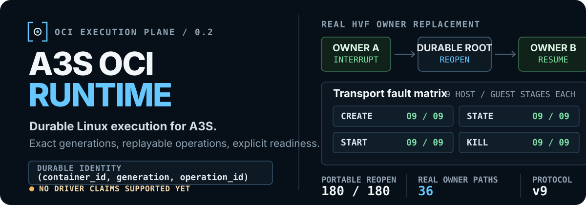

<p align="center">
  
</p>

<p align="center">
  <strong>The low-level execution plane for A3S: official OCI types, durable lifecycle replay, and one reviewed Linux executor across native and utility-VM paths.</strong>
</p>

<p align="center">
  <a href="https://github.com/A3S-Lab/OCI-Runtime/actions/workflows/ci.yml"></a>
  <a href="https://github.com/A3S-Lab/OCI-Runtime/releases/latest"></a>
  
  
  <a href="LICENSE"></a>
</p>

<p align="center">
  <a href="#inspect-before-you-launch">Inspect</a> ·
  <a href="#what-exists-today">Implementation</a> ·
  <a href="#the-runtime-contract">Contract</a> ·
  <a href="#platform-status">Platforms</a> ·
  <a href="#architecture">Architecture</a> ·
  <a href="#run-the-real-gates">Qualification</a> ·
  <a href="#development">Development</a>
</p>

---

**A3S OCI Runtime** owns actual Linux-container execution for A3S: exact OCI
validation, container and process state, monotonic generations, operation
journals, terminal status, platform drivers, utility VMs, the authenticated
guest agent, and runtime-scoped cleanup.

It deliberately does not pull images, build images, implement Compose, own
product networks or volumes, or become a Docker daemon. Those responsibilities
remain in [A3S Box](https://github.com/A3S-Lab/Box), which supplies prepared
bundles, an isolation requirement, and a versioned attachment manifest through
the public `a3s-oci-sdk`.

> [!WARNING]
> This repository is in active development. No built-in driver is currently
> advertised as `supported`. The default host service exposes discovery
> only; Native Linux becomes `experimental` only when explicitly opened as a
> development instance, Apple Silicon HVF is `experimental`, and WHPX remains
> `probe-only`. Experimental means the reviewed development profile may launch;
> it does not imply production certification.

## Inspect before you launch

The first successful action is intentionally read-only:

```bash
git clone https://github.com/A3S-Lab/OCI-Runtime.git
cd OCI-Runtime
cargo run -p a3s-oci-cli -- features
```

On the qualified Windows x86_64 host used for the current branch, the command
reports an available hypervisor and still refuses to overstate driver
readiness:

```json
{
  "schema_version": "a3s.oci.features.v1",
  "platform": "windows",
  "architecture": "x86_64",
  "drivers": [
    {
      "driver": "libkrun-whpx",
      "status": "available",
      "readiness": "probe-only",
      "isolation_classes": [
        "dedicated-vm",
        "shared-guest-kernel"
      ],
      "evidence": {
        "hypervisor_present": "true",
        "win_hv_platform_dll": "true"
      }
    }
  ]
}
```

The evidence object is host-specific. The selection rule is not:

| Reported state | May launch? | Meaning |
| --- | --- | --- |
| host `available` + `probe-only` | No | Diagnostics or qualification only |
| host `available` + `experimental` | With explicit opt-in | Reviewed development profile; release gates remain |
| host `available` + `supported` | Yes | Certified profile |
| host `unavailable` or `unsupported` | No | Prerequisite absent or platform does not apply |

`DriverCapability::can_launch()` requires both an available host capability
and `experimental` or `supported` readiness.

## What exists today

| Layer | Implemented boundary |
| --- | --- |
| Public SDK | Async `Send + Sync` Rust contract using official OCI `Spec`, `Process`, `LinuxResources`, `State`, and `Features` types; typed IDs, generations, operation contexts, versioned attachments, I/O, filesystem sessions, stats, events, and stable errors |
| Validation and transport | Strict OCI 1.0.0–1.3.0 bundle loading, semantic validation, immutable configuration and attachment SHA-256 binding, and bounded protocol-4 local IPC over Unix sockets or protected Windows named pipes |
| Durable host service | Exact create/state/start/kill/delete, driver-advertised optional operations, global idempotency journals including File upload and Filesystem mkdir/move/remove, replay, generation fencing, startup recovery, quarantine, capability-rooted state traversal with Unix mount-identity fencing, post-commit replay-record acknowledgement for local and utility-VM drivers, sorted list, ordered events, and same-UID multi-container owners for Native Linux and Apple Silicon HVF |
| Shared Linux executor | Namespace create/join, `pivot_root`, ordered OCI mounts, the complete OCI 1.3 Linux mount-option control registry, conditional `/dev/fd`, `/dev/stdin`, `/dev/stdout`, and `/dev/stderr` links after mount processing, OCI hooks, user mappings, cgroup v2, all five capability sets with kernel read-back, exact `no_new_privileges` verification, all 16 OCI rlimit types with exact kernel read-back, `oomScoreAdj`, scheduler policy, I/O priority, transactional namespaced sysctls with descriptor-confined apply, read-back, and rollback, devices, seccomp, PID 1 supervision, pidfds, exec, process I/O, PTY, a bounded Host-acknowledged mutation replay journal, parent-bound launch/session helpers, PID-start-time-bound owner-death tombstones, descriptor-confined file/filesystem sessions, pause/resume, resource updates, normalized CPU/memory/PID/block-I/O stats, and scoped cleanup for the qualified profile |
| Utility-VM boundary | Isolated libkrun shim, authenticated protocol v10 with v1-v9 compatibility, 20 public workload operations plus one bounded maintenance acknowledgement, clone-wide shutdown, exact-generation VM sessions, and the same Linux executor behind the static guest agent. Durable recovery records remain on the per-generation share, privileged OCI device sources are created only on Guest-local devtmpfs and removed at the Create barrier, and shutdown consumes every retained device-target manifest before deleting the Guest runtime root |
| containerd runtime-v2 | SDK-only `containerd-shim-a3s-oci-v2` with durable namespace/task identity, lifecycle and exec recovery, and schema-v8 metadata. A retained per-task exec sequence gives every `Exec` incarnation fresh SDK process and operation identities, so `DeleteProcess` can be followed by reuse of the same containerd exec ID across daemon restart without replaying the deleted process. Init/exec input, signal, and terminal-resize journals retain Open/Closing/Closed stdin state, output cursors, independent per-process signal and resize sequences, and a per-task control sequence. The shim also provides process/task-scoped serialization, cross-process-stable request fingerprints, bounded FIFO/PTY I/O, live replacement with exact stdin continuation, committed pending-write, close, signal, and resize replay without duplicate effects, correct `SIGSTOP→SIGCONT→SIGSTOP→SIGCONT` transitions, same-size resize suppression, correct `A→B→A` terminal restoration, no output replay, repeated pause/resume and update, stats, PID inventory, in-flight Create and committed Start/Kill/Delete/Exec/SignalProcess/Pause/Resume/Update/WriteStdin/CloseStdin/ResizePty recovery, post-commit Native Linux guest-journal reclamation, four-state forced shim-crash cleanup, and a four-task parallel restart gate; compatibility, packaging, and cross-driver release gates remain open |
| A3S Box consumer | Public-SDK-only lifecycle and attachments; pause/resume; process and filesystem sessions; exact live inventory, normalized stats, bounded ordered events, and replay-safe complete resource updates; explicit Native Linux Sandbox production routing and real-host SDK composition pass, while default and cross-platform cutover remain open |
| Retained evidence | Schema and normative locks, 189-pair authenticated protocol fault coverage, portable nine-stage Create/State/Start/Kill/Delete/Wait/Exec/SignalProcess/WaitProcess/Pause/Resume/Processes/Update/Stats/ReadOutput/WriteStdin/CloseStdin/Resize/File/Filesystem host reopen with exact post-commit acknowledgement, real-HVF nine-stage Host/Guest Create plus two-stage Host shutdown interruption and cleanup, all nine real-HVF Create, State, Start, Kill, Delete, Wait, Exec, SignalProcess, WaitProcess, Pause, Resume, Processes, Update, Stats, ReadOutput, WriteStdin, CloseStdin, Resize, File, and Filesystem transitions through durable service reopen and VM/session-owner replacement, a real protocol-v10 Apple Silicon Guest boot, native Linux real-container with distinct exact init/exec capability, `NoNewPrivs`, rlimit, OOM-score, I/O-priority, scheduler, and namespaced-sysctl read-back, rootless default-device and device-policy gates, soak, owner-death safe-termination, and three consecutive same-Host live containerd 2.2 lifecycle/restart/I/O matrices with deleted exec-ID reuse, post-commit guest-journal reclamation, and committed WriteStdin/CloseStdin/SignalProcess/ResizePty shim-replacement gates, fresh-VM HVF soak, and WHPX nominal plus owner-death/service-restart qualification |

The current Box adapter at `A3S-Lab/Box@a16772c3` rechecks every read against
the exact runtime binding. File upload/download and filesystem
stat/mkdir/move/list/remove now use the same cross-platform session facade;
capability and Box-generation checks happen before dispatch, response targets
and shapes are revalidated, and one explicitly retryable mutation response is
replayed with the same context and one runtime effect. A partial product
resource request is compiled into one complete OCI `LinuxResources` contract,
claimed durably before dispatch, and replayed with the same runtime operation
after a lost response. Runtime acknowledgement updates Box restart intent
atomically without changing the original create identity.

New mutation records use `a3s.oci.operation.v3`. File uploads and Filesystem
mkdir/move/remove retain their exact validated request and typed response in
the Host journal. The Host commits the result before acknowledging the Guest
replay record, so an acknowledgement disconnect returns a retryable error and
the next owner replays the Host result without dispatching the mutation again.
The Host journal remains the permanent changed-request fence after the Guest
record has been released.

Durable state now pins its canonical root as a directory capability. All
descendant reads, enumeration, creation, replacement, and quarantine moves are
resolved from retained directory handles. macOS, Linux, and Windows gates prove
that an ambient-root rename, layout or transaction symlink/reparse-point
substitution, foreign filesystem handle, same-device Linux bind-mount
replacement, or racing Windows file/directory destination replacement cannot
redirect a mutation. Windows commits each already-open source object relative
to a retained destination-parent handle and applies file DACLs through that
same opened object.

The exact containerd API, identity, installation, restart, cleanup, and
qualification boundary is documented in
[containerd Runtime V2](docs/containerd-runtime-v2.md).

That exact Box revision also validates its managed home, durably prepares the
snapshot lower, named volumes, and networking, compiles the product-owned OCI
bundle, and starts or reuses this runtime's identity-fenced long-lived Native
Linux owner. Its blocking x86_64 and aarch64 Linux lanes drive Rust, Python,
TypeScript, and Go Sandbox lifecycle, exec, filesystem, route-aware stats,
pause/resume, snapshot restore, restart, and cleanup through the explicit
production route.

Box completion and Runtime readiness measure different scopes. Box can finish
its current product contract against a qualified Runtime slice; this repository
still owns all 20 public workload operations, every advertised driver, owner-replacement
semantics, OCI conformance, and release qualification. A completed consumer is
therefore not evidence that the lower-level runtime is complete.

Linux file and filesystem calls execute in a fresh internal helper that inherits
only the exact retained root, user-namespace, and mount-namespace descriptors.
The helper authenticates its parent, rejects duplicate or reordered descriptors,
enters the user namespace before the mount namespace, and then performs the
bounded `openat2` operations. Container IDs therefore remain correct on the
rootfs, bind mounts, ID-mapped mounts, and container-created tmpfs filesystems.

The complete release target is every applicable OCI Runtime Specification
1.3.0 requirement for Linux containers and every advertised driver—not a
reduced A3S-only profile. [ROADMAP.md](ROADMAP.md) keeps completed evidence and
open release gates separate.

Capability set enforcement remains exact and fail-closed for every value the
runtime can grant. When the running kernel or the executor's inherited
authority cannot grant a recognized requested capability, init and exec remove
only that unavailable set membership and send a bounded structured warning to
the supervising agent before crossing exec. Malformed or duplicate warning
frames fail closed instead of becoming untrusted log text.

Linux sysctls now follow the same fail-closed boundary. The SDK accepts only
known IPC, network, UTS-domain, and user-namespace controls in OCI dot or slash
notation. The executor rejects host-global controls and same-host namespace
joins, applies a bounded deterministic transaction through retained procfs,
verifies each value, and restores earlier values if Create does not commit.

## The runtime contract

### Create and start stay separate

```text
creating ── create committed ──▶ created
created  ── start committed  ──▶ running
running  ── init terminated  ──▶ stopped
```

`create` validates and prepares the requested boundary without executing
`process.args`. Only `start` releases the configured process. Invalid
transitions fail without weakening that barrier.

Each durable container record retains:

- the exact validated configuration and digest;
- the complete `a3s.oci.attachments.v1` manifest and its digest for newly
  created records;
- a monotonically increasing runtime generation;
- the runtime-selected driver and effective isolation;
- active operation intent and terminal replay results;
- the exact init and exec-process exit status when observed;
- recovery or quarantine state for an interrupted mutation.

A matching retry reproduces the original result. A stale generation, reused
operation ID with a different payload, unsupported OCI field, unavailable
isolation class, or changed recorded driver fails before mutation.

### Isolation is a requirement, not a driver name

| Request | Boundary | Kernel sharing |
| --- | --- | --- |
| `DedicatedVm` | Hardware utility VM | One workload or pod owns the guest kernel |
| `SharedGuestKernel` | Hardware utility VM | One declared trust domain shares a guest kernel |
| `SharedHostKernel` | Native Linux | Containers share the host kernel |

The caller requests an isolation class. The runtime selects one launch-ready
owner for that class, persists the selected driver, and routes every later
operation back to that exact owner—even after the service reopens with drivers
registered in a different order. It never reroutes historical state or falls
back from a VM boundary to the host kernel.

### The SDK is the execution boundary

```rust,no_run
use a3s_oci_runtime::HostRuntimeService;
use a3s_oci_sdk::RuntimeClient;

#[tokio::main(flavor = "current_thread")]
async fn main() -> a3s_oci_sdk::Result<()> {
    let client = RuntimeClient::new(HostRuntimeService::new());
    let info = client.features().await?;

    println!(
        "host={:?} arch={}",
        info.drivers.platform,
        info.drivers.architecture
    );
    for capability in &info.drivers.drivers {
        println!(
            "{:?}: host={:?}, readiness={:?}, launch={}",
            capability.driver,
            capability.status,
            capability.readiness,
            capability.can_launch()
        );
    }
    println!("operations={:?}", info.operations);
    Ok(())
}
```

`RuntimeClient` can wrap an in-process service or connect over bounded local
IPC. A broken local stream is reported without hidden replay; the next explicit
request reconnects and renegotiates so the caller can retry or reconcile with
the original operation identity. Foreground `run` is only a client composition
of durable create/start/wait/delete calls; it does not create a second
lifecycle API or state machine.

On Linux, the explicit experimental host owner publishes one durable SDK
endpoint without opening KVM:

```bash
a3s-oci native-linux-host-service \
  --root /run/a3s/oci-native \
  --agent /usr/libexec/a3s-oci-agent
```

The owner opens the Native Linux driver and durable state before publishing
`runtime.sock`, serves independently fenced container generations to
authenticated same-UID clients, and reaps driver-owned processes on graceful
shutdown. Box's explicit `A3S_BOX_OCI_MIGRATION=sandbox` production route uses
this owner. The existing `native-linux-service` command remains the
Sandbox-scoped FD 3/4/5 owner for compatibility and focused qualification.

On Apple Silicon, the public HVF owner exposes the same SDK contract while
keeping durable state separate from per-generation VM state:

```bash
a3s-oci macos-hvf-host-service \
  --root "$HOME/Library/Application Support/A3S/oci-hvf" \
  --shim /absolute/path/to/a3s-oci-krun-shim \
  --system-image-manifest /absolute/path/to/system-image.json
```

It prepares an owner-only `0700` root, publishes a same-UID `0600`
`runtime.sock`, accepts concurrent clients, and removes only the socket inode
it created. The service advertises all 20 HVF driver operations plus
`features`, `list`, and `events`, requires the runtime bundle-handoff
extension, and reaps every live dedicated VM on graceful shutdown. The HVF
driver advertises only `DedicatedVm`; shared-guest pooling is not implemented.

The runtime contract suite also restarts the owner across two distinct OS
processes on the same Unix socket or Windows named pipe. The replacement opens
the same durable `HostRuntimeService` state, while one retained client recovers
the exact generation and a live exec target, replays create/start/exec without
duplicate test-driver dispatch, and continues inventory, stdin, signal, wait,
output, and cleanup. This proves the generic process and transport boundary,
not native Linux or utility-VM reattachment on real hardware.

The real Native Linux gate now crosses that process boundary with the actual
driver. The launcher is parent-death-bound before it forks namespace children;
after an owner `SIGKILL`, a replacement process revalidates the immutable
configuration plus owner/launcher/init start-time identities, waits for the
exact workload to disappear, and exposes a stopped cleanup tombstone. It never
claims that a live stream was reattached or fabricates an exit code when no
authenticated parent survived to reap it. Idempotent kill, empty inventory,
explicit missing-exit evidence, stopped-only delete, and executor/cgroup
cleanup are machine-checked on x86_64 and aarch64. Live process-session
reattachment remains open for the Box B2 cutover.

## Platform status

| Host path | Retained real evidence | Current readiness and open gate |
| --- | --- | --- |
| Native Linux x86_64/aarch64 | Rootful and helper-backed rootless lifecycle, including the six OCI default devices and the bounded A3S Box device policy; SDK service transport; exec/PTY/I/O; init/exec scheduler and namespaced-sysctl read-back; cgroup update/stats; hooks; namespace and mount profiles; multi-container fencing; fault cleanup; owner-`SIGKILL` safe termination and stopped cleanup; 25 waves × 4 containers; x86_64/aarch64 Box production-owner composition through all four SDKs plus fresh-Box-process owner-death/restart gates | Default inventory `probe-only`; explicitly opened development driver `experimental`. Live session reattachment, default cutover, production security, and OCI conformance remain |
| Linux KVM utility VM | Device access, ioctl result, and KVM API version probes | `probe-only`; workload driver not implemented |
| macOS arm64/HVF | Public same-UID SDK host service; one dedicated VM per exact generation; manifest-bound immutable ext4 system image with pinned A3S Linux kernel and agent; read-only root disk plus separate writable runtime share; Guest-local devtmpfs sources for privileged OCI device nodes; a real protocol-v10 bridge with all 21 Guest operations; retained full protocol-v9 lifecycle, multi-container, namespace/rootfs enforcement, 3 no-delete cleanup points, 11 transport fault points, 180/180 workload-operation replacement paths, negative asset/authentication gates, and 25 fresh-VM waves; source revision `a5a6b53` passed the revision-bound public-path gate across all 20 driver operations plus `features`/`list`/`events`, Host Service `SIGKILL` recovery, and a separate 25/25 fresh-VM soak with zero transient leaks | `experimental` on Apple Silicon. Every currently advertised public macOS/HVF function is implemented and the protocol-v10 public path is qualified at the recorded revision. Signed release-package qualification, OCI conformance, security review, upgrade/rollback compatibility, and longer release soak remain before `supported` |
| Windows x86_64/WHPX | Real partition/context/guest gates, protocol-v9 lifecycle and filesystem sessions, direct driver qualification, protected per-generation shares, exact exit replay, owner death at both recovery fault boundaries, host-service reopen, stopped-only delete, and complete transient cleanup. The current implementation also builds a reproducible x86_64 ext4 system image, pins Linux 6.12.91 and all native boot assets, attaches the root read-only, and keeps the runtime share separate | `probe-only`; the complete SDK/recovery matrix must still pass with those exact assets on a fresh WHPX host, and in-process native-handle reclamation remains before `experimental` |

Linux discovery and Native Linux development must work when `/dev/kvm` is
missing or unusable. KVM is an optional utility-VM driver, never a prerequisite
for host-kernel execution.

On August 15, 2026, a focused Apple Silicon rerun passed all 14 journaled
`guest-after-response-write` mutation cases with post-commit Guest
acknowledgement. File and Filesystem also passed their complete nine-stage
reopen and real owner-replacement matrices, 18/18 paths in total. The run used
agent SHA-256
`eea01813858f5dd16bed70cbfba87221da6daebb4201b7a628665aad3f615a7d`
and system-image SHA-256
`e888c52e35ba8ed8f747d55bdc32316190dc317865e6919014e434a1e644e6ef`.

The latest WHPX owner-death gate emitted
`a3s.oci.whpx-recovery-smoke-run.v1` from clean runtime commit `2d91cd0`.
That closes the service-restart evidence item. The immutable-image code and
qualification artifact are now present, but they have not yet produced the
fresh-host matrix required to promote the public candidate.

## Architecture

```text
A3S Box (current Sandbox consumer; explicit Native Linux production route
         owns bundle/resource preparation and uses the long-lived SDK owner;
         default, MicroVM, and cross-platform cutover remain open)
a3s-oci CLI
containerd runtime-v2 shim
                         │
                         ▼
                  RuntimeClient
             in-process or bounded local IPC
                         │
                         ▼
              ┌──────────────────────┐
              │ HostRuntimeService   │
              │ validation           │
              │ generations + replay │
              │ recovery + quarantine│
              └──────────┬───────────┘
                         ▼
                 DriverRegistry
             isolation owner selected once
                 ┌───────┴────────┐
                 │                │
       NativeLinuxDriver     utility-VM driver
          host kernel        KVM · HVF · WHPX
                 │                │
                 │        isolated libkrun shim
                 │                │
                 │        authenticated guest agent
                 └───────┬────────┘
                         ▼
                   LinuxExecutor
          namespaces · mounts · hooks · pidfds
          cgroups · process I/O · confined filesystem · exact cleanup
```

Only the isolated `a3s-oci-krun-shim` loads checksum-pinned native libkrun
assets. The SDK, CLI discovery path, durable host service, and Native Linux
driver do not initialize a hypervisor library.

| Owner | Keeps | Must not absorb |
| --- | --- | --- |
| A3S Box product plane | Desired state, images/builds, named volumes, product networks, Compose, health/restart policy, log retention, and secret authorization | Actual PID/VM identity or runtime operation journals |
| OCI Runtime control plane | Exact OCI validation, actual state, generations, replay, exit status, driver selection, recovery, and cleanup | Registry pulls, image builds, Compose, or silent isolation fallback |
| Platform execution plane | Linux enforcement, utility VM, transport, process control, and runtime attachments | Product orchestration or a second durable lifecycle |

## Run the real gates

The portable workspace gate is:

```bash
cargo fmt --all -- --check
cargo test --workspace --all-targets
cargo clippy --workspace --all-targets -- -D warnings
```

Real execution gates require a prepared host and isolated runtime root.

| Host | Entry point | Guide |
| --- | --- | --- |
| Linux x86_64/aarch64 | `bash .github/scripts/native-linux-smoke.sh` | [Native Linux development](docs/linux-native.md) |
| Apple Silicon | `cargo run -p a3s-oci-cli -- hvf-smoke` followed by the signed utility-VM profiles | [macOS HVF development](docs/macos-hvf.md) |
| Windows x86_64 | `scripts/windows-whpx-driver-smoke.ps1` and `scripts/windows-whpx-recovery-smoke.ps1` with a verified container-rootfs archive and `windows-system-image` manifest | [Windows WHPX development](docs/windows-whpx.md) |

The Linux smoke prepares an explicit user-owned cgroup-v2 subtree for the
rootless v4 gate. Before Tokio starts, the CLI retains that exact delegation,
starts a parent-bound effective-root helper, and permanently drops the runtime
owner to its real identity. Ordinary rootless launch uses the helper only to
provide the six OCI default device nodes; it does not invent a
`linux.resources.devices` policy. The separate A3S Box profile also exercises
bounded device-access BPF replacement and rollback. Runtime commit `bed43d2`
passed the full policy profile on x86_64 and aarch64 in CI run `31714178349`.
The v4 gates verify create, live update/stats, workload-proven pause/resume,
durable events, all six nodes, exact policy updates where requested, and
complete cgroup, runtime, session, and marker cleanup. Broader delegated
profiles remain unadvertised promotion work.

When a container creates a private mount namespace but joins an existing user
namespace, the executor pins and type-checks that namespace, observes its real
UID/GID maps through a short-lived namespace helper, and rechecks the namespace
identity before entry. The same detached-mount path then supplies the six
default devices with namespace-root ownership. Native Linux multi-container
v18 and real Apple Silicon utility-VM multi-container v11 both verify the
device type, major/minor number, mode, ownership, workload access, and cleanup.
The same reports cover the image's `/dev` with a fresh tmpfs and require the
four OCI Linux links to resolve to their exact `/proc/self/fd` targets after
every configured mount is in place.

Mount-option discovery and execution now share the SDK's pinned 61-entry OCI
1.3 registry. The executor consumes all required and recommended control
options without leaking them into filesystem data, treats unknown strings as
filesystem-specific data, and returns a typed `Unsupported` error for the
optional `tmpcopyup` behavior. Feature discovery reports the 60 implemented
OCI names plus the `rnodev` extension, in sorted order, and does not advertise
`tmpcopyup`.

These commands can require root privileges, hypervisor access, signed
artifacts, or destructive cleanup within an explicitly supplied test root.
Read the linked host guide before running them.

## Evidence, not slogans

The repository turns release claims into checked inventories:

| Evidence | Current lock |
| --- | ---: |
| Named OCI schema properties and enum values classified | 423 |
| RFC 2119 occurrences across 15 pinned normative OCI 1.3 documents | 764 |
| Typed semantic validation rules | 73 |
| Owner-bound non-semantic rules | 50 |
| OCI normative dispositions | 228 enforced · 25 validated · 2 conformant · 400 pending review |
| Registered durable commit fault stages | 741 |
| Durable-state replacement qualification | macOS/Linux/Windows complete, including a real Linux bind mount and the Windows reparse-point matrix |
| Before/after `RuntimeDriver` fault boundaries | 44 |
| Authenticated agent operation-stage fault pairs | 180 |
| Portable Create/State/Start/Kill/Delete/Wait/Exec/SignalProcess/WaitProcess/Pause/Resume/Processes/Update/Stats/ReadOutput/WriteStdin/CloseStdin/Resize/File/Filesystem host-service reopen pairs | 180 |
| Real HVF Create Host/Guest plus Host shutdown interruption and cleanup stages | 11 |
| Real HVF durable Create reopen plus VM/session-owner replacement paths | 9 |
| Real HVF durable State reopen plus VM/session-owner replacement paths | 9 |
| Real HVF durable Start reopen plus VM/session-owner replacement paths | 9 |
| Real HVF durable Kill reopen plus VM/session-owner replacement paths | 9 |
| Real HVF durable Delete reopen plus VM/session-owner replacement paths | 9 |
| Real HVF durable Wait reopen plus VM/session-owner replacement paths | 9 |
| Real HVF durable Exec reopen plus VM/session-owner replacement paths | 9 |
| Real HVF durable SignalProcess reopen plus VM/session-owner replacement paths | 9 |
| Real HVF durable WaitProcess reopen plus VM/session-owner replacement paths | 9 |
| Real HVF durable Pause reopen plus VM/session-owner replacement paths | 9 |
| Real HVF durable Resume reopen plus VM/session-owner replacement paths | 9 |
| Real HVF durable Processes reopen plus VM/session-owner replacement paths | 9 |
| Real HVF durable Update reopen plus VM/session-owner replacement paths | 9 |
| Real HVF durable Stats reopen plus VM/session-owner replacement paths | 9 |
| Real HVF durable ReadOutput reopen plus VM/session-owner replacement paths | 9 |
| Real HVF durable WriteStdin reopen plus VM/session-owner replacement paths | 9 |
| Real HVF durable CloseStdin reopen plus VM/session-owner replacement paths | 9 |
| Real HVF durable Resize reopen plus VM/session-owner replacement paths | 9 |
| Real HVF durable File reopen plus VM/session-owner replacement paths | 9 |
| Real HVF durable Filesystem reopen plus VM/session-owner replacement paths | 9 |
| Real HVF operation replacement coverage | 180 / 180 paths (20 / 20 operations) |
| Real HVF journaled post-response acknowledgement rerun | 14 / 14 mutations on August 15, 2026 |
| Real HVF lifecycle/transport cleanup fault points | 14 / 14 |
| Real HVF immutable-system-image soak | 25 / 25 fresh VMs (75 primary generations) |
| macOS HVF R2M implementation gates | 15 / 15 |
| Public macOS HVF Host Service implementation | Complete; revision `a5a6b53` passed 23/23 operations, owner replacement, and 25/25 fresh VMs |
| Guest operations behind protocol v10 | 21 (20 public workload operations + 1 maintenance acknowledgement) |

The locks prove inventory and exercised boundaries, not full conformance by
themselves. Remaining normative enforcement, upstream lifecycle suites,
adversarial security, upgrade compatibility, and exact release-artifact
qualification must all pass before a driver becomes `supported`.

### Still intentionally open

- complete review and enforcement of pending OCI normative entries;
- real-host qualification of descriptor-confined filesystem sessions on each
  remaining utility-VM driver;
- production-ready Native Linux and utility-VM drivers;
- live Native Linux process-I/O reattachment across owner death and exact
  terminal evidence when a persistent authenticated reaper can retain it;
- fresh-host qualification of the implemented immutable WHPX system root, and
  implementation plus qualification of the KVM system root;
- utility-VM hook recovery and security certification;
- the default and cross-platform A3S Box cutover, plus the remaining
  containerd compatibility, packaging, and cross-driver gates;
- checkpoint/restore and later attachment extensions;
- signed-package, upgrade, rollback, security, and long-duration release gates.

## Workspace map

```text
crates/sdk/             public async OCI contract, bundle validation, local IPC
crates/core/            lifecycle, isolation, readiness, and capability types
crates/runtime/         durable host service, drivers, probes, state, reports
crates/agent-protocol/  authenticated host/guest wire contract
crates/agent/           static Linux guest agent and shared LinuxExecutor
crates/krun/            isolated shim plus pinned native runtime bundles
crates/cli/             capability inspection and real-host qualification gates
```

## Documentation

- [Roadmap and release gates](ROADMAP.md)
- [Durable lifecycle and recovery](docs/durable-state.md)
- [SDK transport](docs/sdk-transport.md)
- [Versioned attachment contracts](docs/attachment-contracts.md)
- [Guest-agent protocol](docs/agent-protocol.md)
- [OCI 1.3 conformance contract](docs/oci-conformance.md)
- [Normative coverage](docs/normative-coverage.md)
- [Semantic validation](docs/semantic-validation.md)
- [Native Linux development](docs/linux-native.md)
- [macOS HVF development](docs/macos-hvf.md)
- [Windows WHPX development](docs/windows-whpx.md)

## Development

Run checks from the repository root:

```bash
cargo fmt --all -- --check
cargo test --workspace --all-targets
cargo clippy --workspace --all-targets -- -D warnings
RUSTDOCFLAGS="-D warnings" cargo doc --workspace --no-deps
```

Cross-check the supported Linux compilation targets without treating a parent
monorepo as the Rust workspace:

```bash
cargo clippy --target x86_64-unknown-linux-gnu \
  --workspace --all-targets -- -D warnings
cargo clippy --target aarch64-unknown-linux-gnu \
  --workspace --all-targets -- -D warnings
```

Tagged archives contain host diagnostics and the matching platform assets.
Package availability never overrides the readiness reported by the exact
binary's `features` result.

## License

A3S OCI Runtime is available under the [MIT License](LICENSE).
